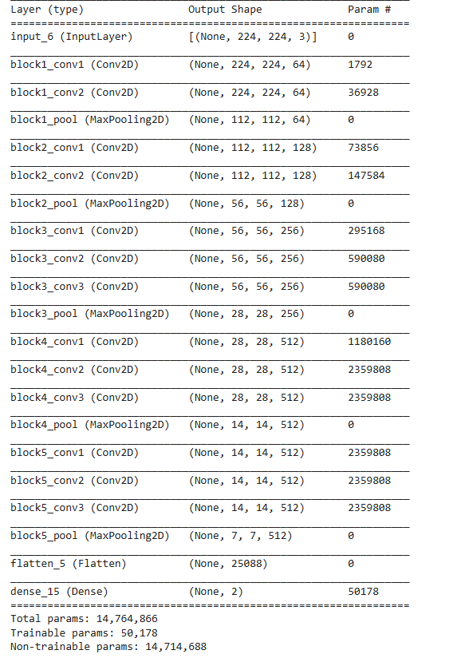

# Malaria-Detection-VGG16
Using State-of-the-Art VGG16 model, Malaria can be detected from segmented cells from the thin blood smear slide images

The dataset contains 2 folders
- Infected
- Uninfected

And a total of 27,558 images.

Dataset taken from :- https://lhncbc.nlm.nih.gov/LHC-downloads/downloads.html#malaria-datasets

Deployed at https://malaria-disease-predictor.herokuapp.com/

 Accuracy                  |  Loss
:-------------------------:|:-------------------------:
       | 

